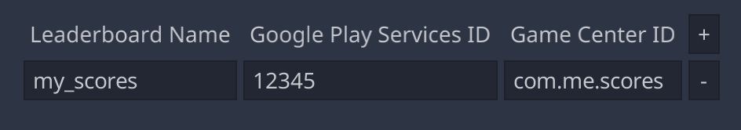

# godot-game-services

[Godot](https://godotengine.org/) native plugins for iOS [Game Center](https://developer.apple.com/game-center/) and Android Google [Play Game Services](https://developers.google.com/games/services) for Godot v3.5.

This plugin was developed with the intention to provide a single standard interface to game services on mobile, thus simplifying development.

The following features are currently supported:

* Authentication

* Leaderboards

Support for other features is planned for the future. If there is a particular feature you would like to see, please either [open a new issue](https://github.com/sjc/godot-game-services/issues) or comment on one of the existing issues to help us prioritise what we work on:

* [Achievements](https://github.com/sjc/godot-game-services/issues/1)

* [Friends Lists](https://github.com/sjc/godot-game-services/issues/2)

These plugins are based on the excellent [AdMob plugin by Poing Studios](https://github.com/Poing-Studios/godot-admob-editor).


## Instalation

### Editor Plugin

Whether you want to use iOS, Android, or both, you will need the Godot editor plugin. Install it in the usual way:

* Download the latest version of the editor plugin from the [releases page](https://github.com/sjc/godot-game-services/releases).

* Copy the `gameservices` folder into the `addons` folder in your project.

* Enable the plugin from "Project" -> "Project Settings…" -> "Plugins".

You will now have access to the `GameServices` singleton from code.


### Android

In order to make use of Play Game Services in your mobile app, you must have an Android developer account and you must have [setup game services](https://developers.google.com/games/services/console/enabling).

**Note:** The OAuth setup for Release builds requires the SHA1 fingerprint of the Play Store signing certificate. Unless you're working on a legacy app, you'll only have access to the upload certificate, since Google now generates and maintains the release certificate for you. In order to find the correct fingerprint to use to setup Release OAuth, you will need to run an Internal Test Track build via the Play Console and look at the output in Logcat to get the fingerprint of the actual distribution certificate, which you'll then need to put into the Play Games console. But this all comes at the end of development. For now, using the Debug setup is preferred.

To install the Android plugin:

* Download the latest version of the Android plugin from the [releases page](https://github.com/sjc/godot-game-services/releases).

* Unzip the archive and copy the `.aar` and `.gdap` files into the `android/plugins` folder in your Godot project.

* You will need to enable the custom Android build template, as described [here](https://docs.godotengine.org/en/stable/tutorials/export/android_custom_build.html).

* Add the following to the `res://android/build/AndroidManifest.xml` file:

```
<manifest>
  <application>
    <meta-data android:name="com.google.android.gms.games.APP_ID"
               android:value="@string/game_services_project_id"/>
  </application>
</manifest>
```

* Add a string resource for `game_services_project_id` with the ID of the Play Game Services project you created for your app.

* In the Android export setting, ensure that "Game Services" is ticked.

**Note:** It's possible that you will encounter [build errors](https://www.reddit.com/r/godot/comments/y4g9pp/the_admob_plugin_in_github_is_not_compatible_with/) when first trying to build after adding the plugin, especially if you are using other Android plugins. These can be resolved by adding the following to your `build.gradle`:

```
android {
    defaultConfig {
        ...
        multiDexEnabled = true
        ...
    }
}
```


### iOS

* Download the latest version of the iOS plugin from the [releases page](https://github.com/sjc/godot-game-services/releases).

* Unzip the archive and copy the `gameservices` folder into the `ios/plugins` folder in your Godot project.

* In the iOS export settings, ensure that "Game Services" is ticked.

* If you want to read leaderboard scores, rather than just displaying the pre-made leaderboard UI, you will need to add the "Game Center" entitlement, else you will not get back player names. To do this, open the exported project in Xcode, select the main project file, and select "+ Capability" from the "Signing & Capabilities" tab.


## Configuring the plugins

The "Game Services" tab in the Godot editor allows you to configure settings used between the iOS and Android plugins.

### Leaderboard IDs



Play Game Services and Game Center use different IDs to refer to leaderboard. You can assign a common name to leaderboards which you can use to refer to them in code. The correct ID for the current platform will be passed to the native API by `GameServices`.

**Note:** On iOS, the leaderboard ID should not include the `grp.` prefix, if one is shown in App Store Connect.


## GameServices API

To learn how to use the `GameServices` singleton in your app, please see [the docs](https://sjc.github.io/godot-game-services).


## Building the plugins

If you wish to build the native plugins yourself, you will need to checkout this repo.

### Android

In the `android-play-game-services` folder:

* Create a `godot-lib` directory.

* Download the `godot-lib.x.y.x.stable.release.aar` file for the version of Godot you are using from [here](https://downloads.tuxfamily.org/godotengine/). Rename it to just `godot-lib.aar` and copy it into the `godot-lib` directory.

* Run `./gradlew build`

The `gameservices/build/outputs/aar` folder will contain the build debug and release `.aar` files. These should be moved into the `android/plugins` directory of the Godot project, along with the `gameservices.gdap` file.

### iOS

In the `ios-gamecenter` folder:

* Create a `bin` directory.

* Download the `extracted_headers.zip` from the [godot-ios-plugin repo's releases page](https://github.com/godotengine/godot-ios-plugins/releases/tag/3.5-stable), unzip it, and copy the `godot` folder into `ios-gamecenter`.

* Run `./scripts/release_static_library.sh 3.x` or `./scripts/release_xcframework.sh 3.x` 

The `bin/release/gameservices` folder will contain the generated plugin files and should be copied into the `ios/plugins` folder of the Godot project.


